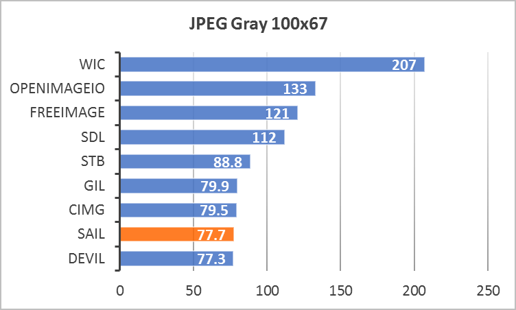
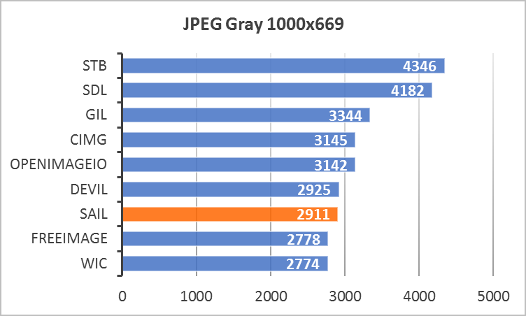
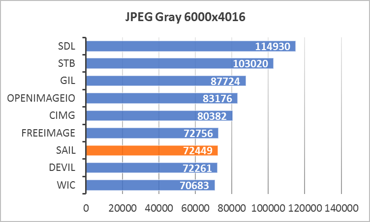
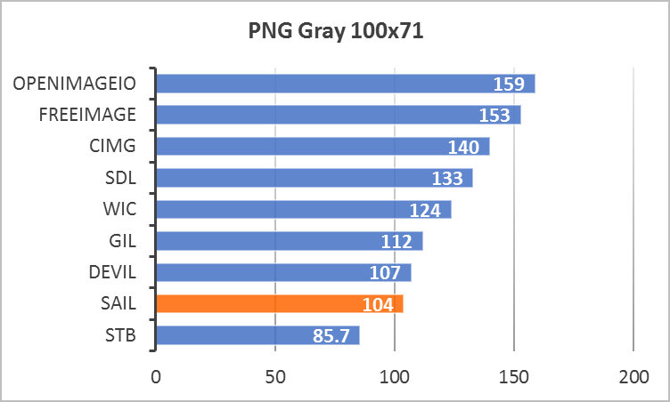
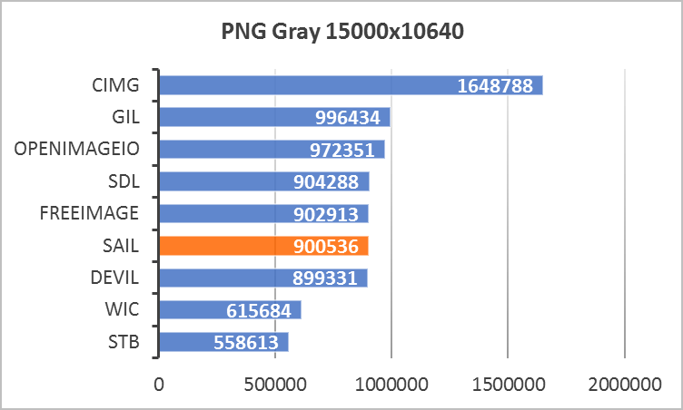
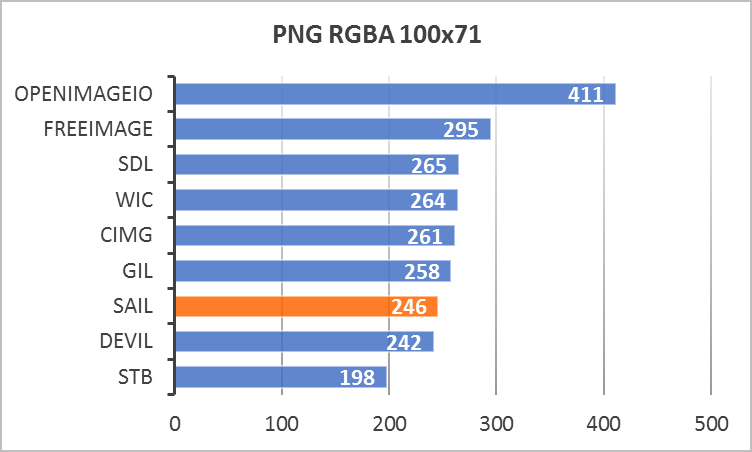

Table of Contents
=================

* [Conditions](#conditions)
* [Results](#results)
  * [JPEG Gray](#jpeg-gray)
  * [JPEG YCbCr](#jpeg-ycbcr)
  * [PNG Gray](#png-gray)
  * [PNG RGBA](#png-rgba)

## Conditions

| Condition                               | Value                |
| --------------------------------------- | -------------------- |
| **Operating System**                    | Windows 7 x64        |
| **Compiler**                            | MSVC 2019 x64        |
| **Libraries Under Test (LUT)**          | [Boost.GIL](https://www.boost.org/doc/libs/1_68_0/libs/gil/doc/html/index.html), [CImg](https://github.com/dtschump/CImg), [DevIL](http://openil.sourceforge.net), [FreeImage](https://freeimage.sourceforge.io), [OpenImageIO](https://github.com/OpenImageIO/oiio.git), [SAIL](https://github.com/smoked-herring/sail), [SDL_Image](https://www.libsdl.org/projects/SDL_image), [stb_image](https://github.com/nothings/stb), [WIC](https://docs.microsoft.com/en-us/windows/win32/wic/-wic-about-windows-imaging-codec) |
| **LUT Installation Mode (except SAIL)** | vcpkg                |
| **SAIL Installation Mode**              | vcpkg                |
| **Benchmarks**                          | [sail-benchmark](https://github.com/smoked-herring/sail-benchmark) |
| **Measured Time**                       | Real (wall clock)    |
| **Measurement Units**                   | Microseconds         |
| **Output Pixels**                       | Default              |
| **Hardware**                            | Lenovo Thinkpad W540 |
| **CPU**                                 | Intel Core i7-4800MQ |
| **Power Cable**                         | Connected            |
| **Power Plan**                          | Maximum Performance  |

## Results

### JPEG Gray

### JPEG YCbCr

### PNG Gray

### PNG RGBA

